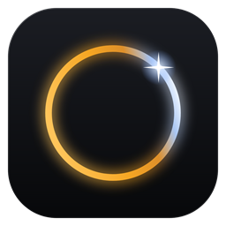

# Orynex

A Windows 11 desktop assistant that lives at the edge of your screen. It answers,
it acts on the machine, and it keeps what it learns on the machine.

**[→ Download Orynex 0.9.1](https://github.com/70cacao/Orynex/releases/download/v0.9.1/Orynex_0.9.1_x64-setup.exe)** · Windows 11 · 88 MB · [release notes](https://github.com/70cacao/Orynex/releases/tag/v0.9.1)

**New in 0.9.1: connections, flows, your phone.** Connect services over MCP or your own API from its OpenAPI description, and approve every capability one by one. Orynex writes to your Google Calendar after a second permission, with a card for every change. *„Take the text from the editor and send it to Tom“* becomes **one plan, one yes**, then runs without the AI. From away — Telegram or **your phone's browser**, HTTPS on your home network with its own certificate — a **traffic light** decides: green runs, yellow is checked by a second AI and then asks you, red never runs. The voice is **ElevenLabs on your own key** when you want it, the Windows voice otherwise, and Telegram answers a voice message by voice.

**In 0.6.0: automations.** Rules you write — *every morning at eight*, *when VALORANT starts* — with five risk rings deciding how far each may go while you are away: deleting, the screen and anything privileged never run without you, mail goes only to addresses on your own list, and everything above a rule's ring waits for your yes. Orynex suggests rules from habits it notices, and asks first. **It speaks** (the Windows voice, made on your PC), **it answers on Telegram** through your own bot, scenes switch **Windows settings** and run **your own commands and scripts** — never elevated, never written by the AI. A new look with real app icons and a scene editor you drag into order, and signed updates.

**In 0.5.9: say what a scene is for.** *"Orynex, mach mich bereit zum Zocken"* runs the scene you built for gaming — the AI picks one of your saved scenes by name, never writes its steps, and a scene that ends a program shows every step and waits for your click first. Replies to mail, and sending from iCloud and Microsoft 365. **Earlier in 0.5: Orynex reads files.** *"What's in this folder"*, *"read me the README"* — anywhere on your disk except keys, passwords, browser and messenger data, which are refused however the request is worded. **It can send mail**, from the account it already reads, behind its own switch and with a card showing the whole message before each one goes out. **A second provider is one click away:** keep several API keys and switch between them, choose the model by hand, and NVIDIA's catalogue is supported. Speech input sends directly when Orynex is not in front — press, speak, read the answer without leaving your game. And a new look. Earlier: screen control behind a switch (0.4.11), [scenes](#scenes) (0.4.9), [local AI and Full Privacy](#cloud-or-local-and-full-privacy) (0.4.6).

**Status: pre-release, and the source is not public.** It is not code-signed yet,
so Windows will warn about an unknown publisher — the release notes say why, and
what else is unfinished. This repository is the project's public face: what it
is, how it is built, and what it deliberately does not do. See
[LICENSE](LICENSE): all rights reserved.

---

## Install

**1 · Download and run it.** Windows will stop you: *"Windows protected your PC —
unknown publisher"*. That is the missing code-signing certificate, not the file.
Click **More info**, then **Run anyway**. If you would rather not — that is a
reasonable instinct and there is nothing here to argue with it.

**2 · Say yes to the admin prompt.** It installs into `Program Files` and
registers one small helper that runs elevated. The assistant itself never does
(see below).

**3 · Pick a language,** then two choices with sensible defaults: install the
privilege broker (say yes — without it a few actions report themselves as
unavailable), and start with Windows.

**4 · Choose where the AI runs. Nothing works before this.** Open the workspace —
hover the dot at the top edge, then the ⤢ button — and go to **Account**.

*Local:* install [Ollama](https://ollama.com/download), then in **KI: Cloud oder
Lokal** pick a model you already have, or choose one from the tiers Orynex shows
for your GPU — *Minimum* from 4 GB, *Empfohlen* 12–16 GB, *Advanced* from 32 GB —
and download it with one click. No key, no account.

*Cloud:* under **KI-Anbieter (Cloud)**,
paste an API key and press Verbinden. **The provider is detected from the key
itself**, so there is nothing to choose: `gsk_…` is Groq, `sk-…` OpenAI or
Anthropic, `AIza…` Google, `nvapi-…` NVIDIA, and so on. With more than one key
stored, a dropdown switches between them, and each remembers its model. The key is checked once against the
provider and then goes into the Windows Credential Manager — never into a file,
never into a log.

> **No key yet?** Groq issues one free at [console.groq.com](https://console.groq.com)
> and is what this was built against. There is no account with *me* and no server
> in between — your key talks to your provider, directly.

**5 · Optional:** a [Tavily](https://tavily.com) key on the same page turns on web
search. Everything else works without it.

**Uninstalling** is the ordinary way: Settings → Apps → Orynex. Your conversations,
notes and settings are deliberately left behind, in
`%APPDATA%\com.ceruleancircle.copilot` — uninstalling an app is not the same as
asking it to forget. Delete that folder if you want it gone.

## What it is

Most assistants are a website in a window. Orynex is a native application: Rust
and [Tauri v2](https://tauri.app) underneath, React and TypeScript on top, and it
talks to the Windows APIs directly. **No Python, no second runtime** — one binary
and an installer.

Conversation history, the searchable memory, the decision log and every learned
pattern live in a local SQLite database. What leaves the machine is the request to
the model — unless the model runs locally — and the calls a tool makes when you
ask for something outside it, like the weather or your calendar. With Full Privacy
on, Orynex makes neither.

**You bring your own key — or your own model.** Orynex has no server between you
and the provider: your key goes into the Windows Credential Manager, and the
client calls the provider directly. Seven cloud providers are supported (Anthropic,
OpenAI, OpenRouter, Groq, xAI, Google Gemini, NVIDIA), with tool calling, vision and
streaming across all of them — and local models through Ollama or any
OpenAI-compatible server on your PC.

## Cloud or Local, and Full Privacy

Orynex owns the harness: the tools, the safety checks, the memory, the interface.
The language model is a replaceable part. Two switches decide how much of it stays
home.

| Switch | What it does |
| --- | --- |
| **Cloud or Local** | Cloud uses your own API key. Local uses a model on your PC through Ollama (or LM Studio and similar): Orynex finds the runtime, lists what you have, suggests models in three tiers by GPU memory, downloads one on a click and loads it right away, so the first answer does not wait. |
| **Full Privacy** | Orynex sends nothing to an external AI or cloud service. Cloud AI is locked; tools that call outside services — web search, weather, news, mail, calendar, GitHub — are off; speech input, which uses a cloud transcription service, is off. |

What makes that more than a label — each of these is a rule in code with a test
that fails if the rule is removed:

- **No silent fallback.** If the local model fails, you get an error that says what
  to do. Orynex never quietly asks a cloud provider instead, even with a key stored,
  and Full Privacy never quietly changes your model either.
- **Every model gets the same checks.** A local model is exactly as untrusted as a
  cloud one: its tool calls pass the same kill switch, privacy gate, permission
  check and argument validation.
- **Local means this machine.** Local addresses are accepted on loopback only, no
  API key is ever sent to a local server, and Ollama's own *cloud* models — which
  answer on the same local port but compute elsewhere — are refused in Local mode.
- **Enough context.** Orynex asks Ollama for an 8 192-token context through its
  native API; left alone, Ollama cuts long prompts to 4 000 tokens on most GPUs
  without saying so.
- **Measured on a real machine, not assumed.** On a 4 GB laptop GPU, a small local
  model could not follow the extra "which area?" round Orynex uses to save cloud
  tokens (0 of 12), but picked the right tool from the full list in 12 of 18 runs —
  so local turns skip that round, since local tokens cost nothing. Preloading the
  model cut the first answer from ~50 seconds to ~0.3.

What it does **not** claim: that nothing leaves your PC. Windows, your other
programs and a page you ask Orynex to open are not Orynex's to promise. A local
model can also be slower and less accurate than a large cloud model — the
capabilities stay the same, how well a model uses them does not.

## Four stages, one application

It grows only as far as the task needs.

| | |
| --- | --- |
| **Orb** | A dot at the edge of the screen. Idle, ambient, out of the way. |
| **Bar** | Hover it: CPU, GPU, memory, battery, media controls. |
| **Quick panel** | One question, or one of the programs you named yourself. |
| **Workspace** | The full window — chat, tools, memory, decision log, settings. |

## Scenes

Several programs, one press. A scene is a name and up to six steps, and a step
is one of these: **start a program** (or bring it forward if it runs, or leave it
alone if it already is — pressing twice starts nothing twice), **open a web
address**, **open a Spotify search**, **play, pause or skip in a named app**, and
for a performance mode **end a program**, **switch the power plan** or **set the
volume**. Ending is immediate and matches the executable's exact name, and
Windows' own processes are never ended. Nothing else, on purpose: a scene runs days after it was written, with
nobody watching, so every step has to mean the same thing tomorrow. A click on
*"Send"* in another program does not — so scenes never click — and a play/pause
*toggle* would start the music it was meant to stop, so there is none.

Make one in the settings, or say *"open discord and spotify"* in the chat and keep
what happened under a name. It sits as a chip in the quick panel, and its name
typed alone into the chat runs it — without the AI. **Or say what it is for**: *"mach mich bereit zum Zocken"* runs the scene called *zocken*. The AI can only pick one of your saved scenes by its name, never change what is in it, and a scene that ends a program shows a card with every step before anything runs. Measured with a cloud model: 8 of 10 times it picked the scene, the other two it asked back; a sentence without the scene's word does not find it — name a scene the way you would say it. Every step goes through the
same permission checks as a tool the AI calls, and the kill switch stops a scene
between two steps.

## What it can do

Around thirty tools, grouped by area, each one declaring what it needs before it
runs: start and focus applications and open folders, reading folders and text
files, media and volume, system state, clipboard, web search and opening pages,
RSS feeds, weather, reading and sending mail and Google Calendar, reading Windows
notifications and replying in a messenger, reading the screen, and a set of
read-only GitHub tools.

**Reading files** stops at a block list that is about what must never reach a
model: SSH and cloud keys, `.env` files, password databases, browser profiles,
messenger sessions, wallets and Orynex's own data. It is judged on the path as
written *and* on where it really leads, so a shortcut or junction into a blocked
folder is refused too. On a cloud route what a file contains goes to your
provider — that is the price of the convenience, and it is stated here rather
than hidden.

**Sending mail** is off until you turn it on. Then every single message shows a
card with each recipient, the subject and the full text, and goes out only on
your click; an address you did not type yourself is marked. The yes is bound to
exactly that message — change one character and it no longer counts. The kill
switch and Full Privacy both stop it.

The model does not get a free hand. A shortlist round narrows thirty tools to the
handful that could plausibly matter before any of them is offered, and a phrase
that has already resolved to exactly one tool runs again without asking the model
at all.

## What it deliberately does not do

This part matters more than the feature list.

- **The application never runs as administrator.** The handful of actions that
  genuinely need admin rights go through a separate, small helper process
  registered as a scheduled task. The surface that runs elevated stays small
  enough to read in one sitting.
- **Every tool declares the capability it needs**, and the check happens in the
  router before the tool runs — never inside the tool. A new tool cannot quietly
  grant itself something.
- **Secrets are never in a configuration file or a log.** They live in the
  Windows Credential Manager, and the provider key never leaves the module that
  talks to the provider.
- **Screen perception and control are explicit, opt-in and on demand.** No silent
  background capture, no autonomous clicking. Consent is asked for, the click
  marker is shown *before* anything is pressed, and every screen action is
  logged.
- **Nothing is proposed from what it has learned.** Orynex observes which
  programs and tools you use together and counts them, and that is where it
  stops. The counts are visible and deletable; nothing acts on them.
- **Deletion is complete.** Clearing the history removes the transcript *and* its
  search index, in that order — an index that outlives its source is a privacy
  defect, not an untidiness.

## Memory

A small local model turns conversations, notes and documents into vectors —
about 130 MB shipped with the application, so retrieval works with no network
and no second service. Vector search is fused with SQLite's own full-text search,
because the things people ask about by name — a file, a version, an error string
— are exactly what embeddings are worst at.

What was retrieved, what it scored, and why a turn decided what it decided is
visible on the decision log. The assistant does not get to be a black box on its
own machine.

## Built with

Rust · Tauri v2 · React · TypeScript · SQLite (FTS5) · ONNX Runtime · native
Windows APIs · NSIS

**1 331 tests** green at the last full run, alongside a written architecture and a decision
log that records why things are the way they are rather than only what they do.
Security rules are checked by mutation: remove the rule, and a test has to fail.

## Availability

**[Orynex 0.9.1](https://github.com/70cacao/Orynex/releases/tag/v0.9.1)** — a
pre-release, published on 25 September 2026. Connections, the catalogue, the
calendar's write side, flows, the traffic light, the phone door and the voice are
covered by unit tests and 111 mutation probes, every rule covered; a real
connection, the phone door and a yellow card from away were driven through the
running application. Writing to a real calendar, a real phone, ElevenLabs and a
voice reply on Telegram are **not yet tried** with real accounts. Earlier, for
0.6.0: Automations, the risk rings and the
rules for commands are covered by unit tests and mutation probes; which sentence
reaches the rule tool was measured against a cloud model. The Windows voice, the app
icons and the settings were made and read on a real machine. Telegram, a rule
running overnight and the updater end to end are **not yet tried** with real
accounts. Earlier, for 0.5.9: Running a scene from a sentence was
measured against a cloud model and driven twice through the running application
(six of six steps, then five of six when Windows refused to bring one program to
the front). Replies to mail and sending from iCloud and Microsoft 365 are not yet
tried against real accounts. File reading, the blocked paths,
switching providers and sending mail were driven through the running
application against a real machine and a real mailbox (a declined card sent
nothing, a confirmed one arrived once). Which model picks the file tool was
measured before and after the change that fixed it, not assumed. The local path
has been run against a real Ollama with a small model; larger models follow
Ollama's published sizes and have not been run here. The calendar's read side is not yet
tried against a real account. The release notes list what else is unfinished.

It is **not code-signed**. Windows SmartScreen will say *"unknown publisher"*;
that is about the missing certificate, not about the file. **More info → Run
anyway** gets past it. A certificate costs several hundred euros a year and this
is a hobby project so far — saying so plainly seemed better than waiting.

## Licence

Proprietary — see [LICENSE](LICENSE). All rights reserved. The software may be
used, once distributed, but not modified, redistributed or published. This is
not an open-source project and code contributions are not accepted.

For licensing enquiries: micha@ceruleancircle.com
